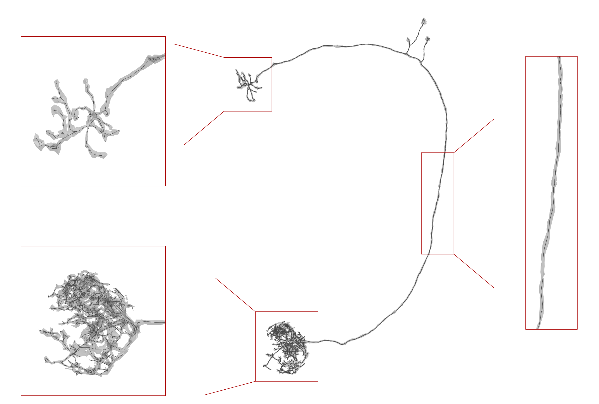
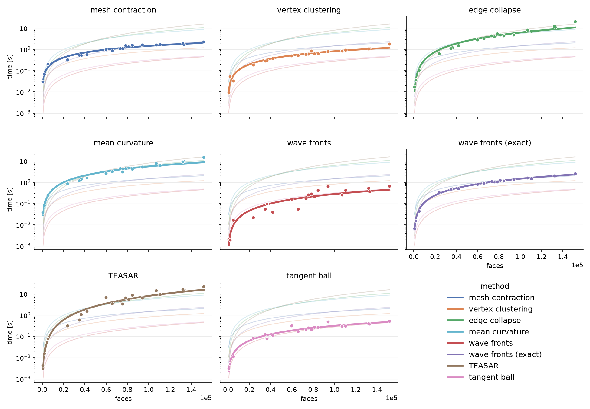

[](https://navis-org.github.io/skeletor/) [](https://github.com/navis-org/skeletor/actions/workflows/test-package.yml) [](https://zenodo.org/badge/latestdoi/153085435)

# Skeletor
Unlike its [namesake](https://en.wikipedia.org/wiki/Skeletor), this Python 3 library does not (yet) seek to conquer Eternia but to turn meshes into skeletons.

`skeletor` implements a number of different skeletonization methods, including mesh contraction, edge collapse, TEASAR, wavefront propagation and mean curvature skeletons -- see documentation and benchmarks below. We also provides a number of pre-/post-processing methods to clean up in- and outputs.

_Please see the [changelog](https://github.com/navis-org/skeletor/blob/master/NEWS.md) for a summary of recent changes._

## Install
```bash
pip3 install skeletor
```

For the dev version:
```bash
pip3 install git+https://github.com/navis-org/skeletor@master
```

#### Dependencies
Automatically installed with `pip`:
- `networkx`
- `numpy`
- `pandas`
- `scipy`
- `trimesh`
- `tqdm`
- `python-igraph`
- `ncollpyde`

Optional because not strictly required for the core functions but  recommended:
- [navis-fastcore](https://github.com/navis-org/fastcore-rs) for sizeable speed-ups with most methods: `pip3 install navis-fastcore`
- [fastremap](https://github.com/seung-lab/fastremap) for sizeable speed-ups with some methods: `pip3 install fastremap`
- [robust_laplacian](https://github.com/nmwsharp/robust-laplacians-py) for more robust Laplacian operators: `pip3 install robust_laplacian`
- [pyglet](https://pypi.org/project/pyglet/) is required by trimesh to preview meshes/skeletons in 3D: `pip3 install pyglet`

## Documentation
Please see the [documentation](https://navis-org.github.io/skeletor/) for details.

The change log can be found [here](https://github.com/navis-org/skeletor/blob/master/NEWS.md).

## Quickstart
For the impatient a quick example:

```Python
>>> import skeletor as sk
>>> mesh = sk.example_mesh()
>>> # To load and use your own mesh instead of the example mesh:
>>> # import trimesh as tm
>>> # mesh = tm.Trimesh(vertices, faces)  # or...
>>> # mesh = tm.load_mesh('mesh.obj')
>>> fixed = sk.pre.fix_mesh(mesh, remove_disconnected=5, inplace=False)
>>> skel = sk.skeletonize.by_wavefront(fixed, waves=1, step_size=1)
>>> skel
<Skeleton(vertices=(1258, 3), edges=(1194, 2), method=wavefront)>
```

All skeletonization methods return a `Skeleton` object. These are just
convenient objects to represent and inspect the results.

```Python
>>> # location of vertices (nodes)
>>> skel.vertices
array([[16744, 36720, 26407],
       ...,
       [22076, 23217, 24472]])
>>> # child -> parent edges
>>> skel.edges
array([[  64,   31],
       ...,
       [1257, 1252]])
>>> # Mapping for mesh to skeleton vertex indices
>>> skel.mesh_map
array([ 157,  158, 1062, ...,  525,  474,  547])
>>> # SWC table
>>> skel.swc.head()
   node_id  parent_id             x             y             z    radius
0        0         -1  16744.005859  36720.058594  26407.902344  0.000000
1        1         -1   5602.751953  22266.756510  15799.991211  7.542587
2        2         -1  16442.666667  14999.978516  10887.916016  5.333333
>>> # Save SWC file
>>> skel.save_swc('skeleton.swc')
```

If you installed `pyglet` (see above) you can also use `trimesh`'s plotting capabilities to inspect the results:

```Python
>>> skel.show(mesh=True)
```



## Benchmarks


Each panel highlights one method (data points + fit); the faint lines in the
background are the fits for all the other methods, so you can compare them at a
glance (note the shared, logarithmic time axis).

[Benchmarks](benchmarks/skeletor_benchmark.ipynb)
were run on an Apple M3 Max (36 Gb memory) with the optional `fastremap` and
`navis-fastcore` dependencies installed. Note some of these functions (e.g. contraction and
TEASAR/vertex cluster skeletonization) can vary a lot in speed based on
parameterization.

## Contributing
Pull requests are always welcome!

## References & Acknowledgments
Mesh contraction and the edge collapse approach are based on this paper:
`Au OK, Tai CL, Chu HK, Cohen-Or D, Lee TY. Skeleton extraction by mesh contraction. ACM Transactions on Graphics (TOG). 2008 Aug 1;27(3):44.`


Mean curvature skeletons are based on the following paper:
`Tagliasacchi A, Alhashim I, Olson M, Zhang H. Mean Curvature Skeletons. Computer Graphics Forum (SGP). 2012;31(5):1735-1744.`

The wavefront approach corresponds to a Reeb graph of the geodesic distance
function on the mesh: connected level sets of the distance field are collapsed
to their centroids to form the skeleton. The core construction was described
by:
`Verroust A, Lazarus F. Extracting skeletal curves from 3D scattered data. The Visual Computer. 2000;16(1):15-25.`
See also the Reeb graph framing in `Hilaga et al., Topology Matching for Fully
Automatic Similarity Estimation of 3D Shapes, SIGGRAPH 2001` and `Ge et al.,
Data Skeletonization via Reeb Graphs, NeurIPS 2011`.

Some of the code in skeletor was modified from the
[Py_BL_MeshSkeletonization](https://github.com/aalavandhaann/Py_BL_MeshSkeletonization)
addon for Blender 3D created by #0K Srinivasan Ramachandran and published under GPL3.

The mesh TEASAR approach was adapted from the implementation in
[meshparty](https://github.com/sdorkenw/MeshParty) by Sven Dorkenwald, Casey
Schneider-Mizell and Forrest Collman.
